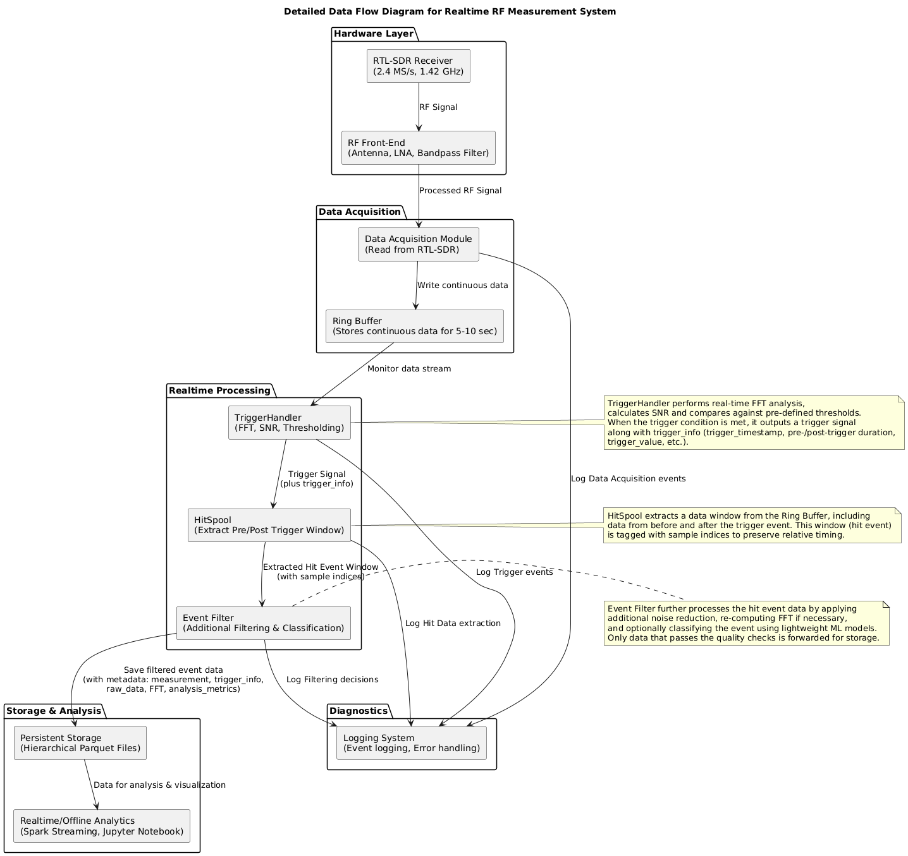

# Arkkitehtuuri

## Yleiskatsaus

Tässä kuvataan signaalimittauksen prosessointimalli, joka hyödyntää hajautettua datankäsittelyä. Se yhdistää laitteistokomponentit kuten Antennin, LNA:n, ohjelmistoradion sekä ohjelmistokomponentit Avro-pohjaiseen skeemanhallintaan ja parquet-muotoiseen tallennukseen. Järjestelmän suunnittelulla tavoitellaan modulaarisuutta ja skaalautuvuutta, jotta se soveltuu suurten datavirtojen reaaliaikaiseen käsittelyyn ja analysointiin.

## Kokonaisarkkitehtuuri

Järjestelmä koostuu seuraavista pääkomponenteista:

### 1. **Laitteisto (Hardware Layer)**

- **Antenni** (Dipoli/Yagi) vastaanottaa RF-signaalin.
- **RTL-SDR** tai muu ohjelmistoradiovastaanotin muuntaa RF-signaalin digitaaliseksi IQ-muotoon.
- **LNA (Low Noise Amplifier)** vahvistaa heikkoja signaaleja.

### 2. **Datan vastaanotto ja esikäsittely**

- **Data Acquisition Layer** vastaanottaa ja puskuroiden dataa.
- **Ring Buffer** säilyttää jatkuvasti liikkuvaa datavirtaa (5–10 sekuntia) minimoiden viiveet.
- **Trigger Handler** analysoi reaaliajassa signaaleja ja määrittää, milloin tallennus käynnistetään.
- **Hit Spool** varmistaa, että signaalin kriittinen osuus ennen ja jälkeen trigger-tapahtuman tallennetaan analyysia varten.
- **Event Filter** suodattaa häiriöt ja merkityksettömät tapahtumat ennen tallennusta.

### 3. **Datan tallennus ja versionhallinta**

- **Avro-skeemat** määrittelevät mittaustiedon rakenteen ja versionhallinnan.
- **Parquet-tiedostot** toimivat varsinaisena tallennusformaatina, joka mahdollistaa tehokkaat haut ja analyysit.
- **Datan partitiointi** tapahtuu ajallisesti (vuosi/kuukausi/päivä/tunti), jotta haut ovat nopeita ja kustannustehokkaita.

### 4. **Datan analyysi ja visualisointi**

- **PySpark-pohjainen käsittely** mahdollistaa hajautetun analytiikan suurille datamäärille.
- **Jupyter Notebook** käytetään signaalin analysointiin ja visualisointiin.
- **Grafana/Prometheus** tukee järjestelmän monitorointia ja tilan seurantaa reaaliaikaisesti.

## Dataflow-kaavio

Alla oleva kuva havainnollistaa, miten data liikkuu järjestelmän läpi.

## Skeeman hallinta ja versionointi

Järjestelmä käyttää **Avro-skeemojen versionhallintaa**, joka mahdollistaa järjestelmän evoluution ilman yhteensopivuusongelmia. Skeemat tallennetaan numeroituna hakemistoon `/schemas/avro/`, ja niitä käytetään Parquetin skeeman määrittelyyn.

## Skaalautuvuus ja suorituskyky

- **Parquet tiedostojen partitiointi ja indeksointi** mahdollistavat tehokkaan haun ja analyysin.
- **Hajautettu käsittely** PySparkilla takaa suurten tietomäärien prosessoinnin.
- **Parquet-muoto** minimoi tallennustilan ja nopeuttaa hakuja.
- **Ring Buffer** mahdollistaa reaaliaikaisen korkean resoluution käsittelyn ilman tietojen menetyksiä.
- **Hit Spool tukee dynaamista analyysia**, mahdollistaen tapahtumien syvemmän tarkastelun.

## Hit Spool

Hit Spool on tapahtumasta triggeröityvän signaaliprosessoinnin keskeinen komponentti, joka tallentaa signaalidataa ennen ja jälkeen trigger-tapahtuman. Tämä lähestymistapa on saanut inspiraationsa IceCube-neutriino-observatorion HitSpooling-mekanismista, jossa havaittujen tapahtumien ympäriltä tallennetaan lisätietoa syvällisempää analyysiä varten. Järjestelmä mahdollistaa joustavan analyysin ja signaalien syvemmän tarkastelun:

- **Joustava aikaväli** – Kun triggeri laukeaa, järjestelmä voi mukauttaa tallennettavan datan aikajaksoa, esimerkiksi tallentaen X sekuntia ennen ja Y sekuntia jälkeen tapahtuman.
- **Reaaliaikainen tarkennus** – Tietojen käsittely ei rajoitu vain triggeröityyn hetkeen, vaan myöhemmin voidaan säätää analyysiä ja tarkastella laajempaa tai suppeampaa aikajaksoa.
- **Eri analyysimenetelmät** – Tapahtumien ympärillä oleva data voi auttaa havaitsemaan esimerkiksi edeltäviä ilmiöitä, kausaalisuhteita tai sekundäärisiä signaaleja, jotka muuten saattaisivat jäädä huomaamatta.
- **Joustava jälkikäsittely** – Jos havaitaan epäilyttäviä signaaleja, voidaan tallennettuja hit event -ikkunoita analysoida tarkemmin eri algoritmeilla tai manuaalisesti.
